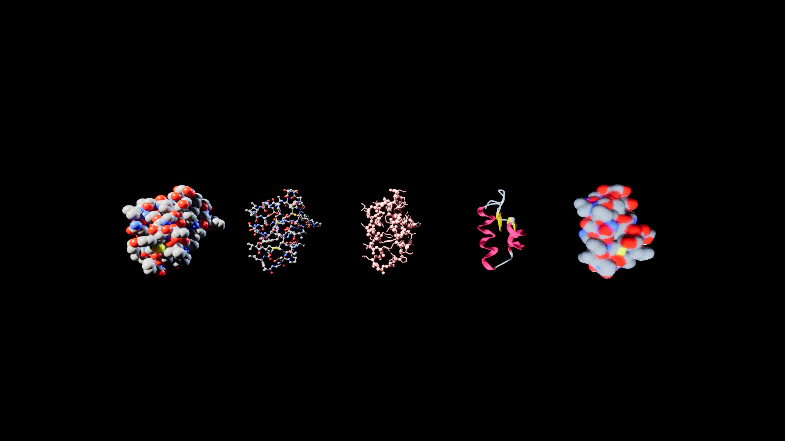

# MolecularForge

Protein and molecule visualization for Unreal Engine 5.8. Reads PDB and mmCIF, fetches from
RCSB and AlphaFold, and renders space-filling, ball-and-stick, backbone, cartoon ribbon and
Gaussian surface.



<!-- SF-STORE-BLOCK:BEGIN -->
## 🛒 Source-available — see before you buy

This repository contains the **full source** of a commercial Unreal Engine plugin. It is **source-available, not open source**: read it, evaluate it, then buy a license to use it. See **the Fab Content License Agreement / Unreal Engine EULA (purchase required)**.

**Get it / Buy:**
- Fab store — all our UE5 plugins: https://www.fab.com/sellers/Silvan%20Teufel

_This plugin does not have its own Fab listing yet — the store link above is where everything we currently sell lives._

### 📬 **Free UE5 Snippet-Pack**

10 ready-to-use C++/Blueprint building blocks (subsystems, versioned saves, async nodes, editor tooling) — MIT licensed. Get it by joining the newsletter — plus a heads-up when something new ships. Double opt-in, unsubscribe in one click, no address sharing.

👉 **[Get the free pack](https://silvan.teufel-engineering.com/newsletter/plugins/?q=gh)**

_© 2026 Silvan Teufel. All rights reserved._
<!-- SF-STORE-BLOCK:END -->

## Quick start

1. Enable the plugin. It pulls in ProceduralMeshComponent, Niagara and MassGameplay, all of
   which ship with the engine.
2. Drop an **MolecularStructureActor** into a level.
3. Set **StructureFilePath** to a `.pdb` or `.cif` file — relative paths resolve against the
   project directory, so `Plugins/MolecularForge/Demo/1EMA.pdb` works out of the box.
4. Pick a **Representation** and a **ColorScheme**. That is the whole setup.

To fetch instead of load, use the Blueprint node **Fetch Structure** with a PDB ID
(`1CRN`) or a UniProt accession (`P69905`, resolved through the AlphaFold database).

## Example levels

Under `Content/MolecularForge/Maps/`:

| Level | Shows |
|-------|-------|
| `L_MF_Showcase` | GFP (1EMA), 1771 atoms, CPK colours |
| `L_MF_Comparison` | Crambin (1CRN) in all five representations at once |
| `L_MF_Mesoscale` | 780 molecules diffusing and binding on Mass |

Every level is generated by a script in `Tools/`, not hand-placed, so it can be rebuilt
after any change:

```powershell
UnrealEditor-Cmd.exe <uproject> -run=pythonscript `
  -script="<Plugin>/Tools/build_showcase_level.py" -unattended
```

## Modules

| Module | Contains |
|--------|----------|
| `MolecularForgeRuntime` | Parsers, structure data, DSSP, selection language, measurements, DCD |
| `MolecularForgeRender` | Atom, bond, cartoon and surface components; structure actor; trajectory player |
| `MolecularForgeWeb` | RCSB and AlphaFold fetching, identifier validation, on-disk cache |
| `MolecularForgeNiagara` | Structure to Niagara array parameters |
| `MolecularForgeMass` | Mesoscale spawner, diffusion and binding processors, staggered renderer |

## Tests

53 automation tests under the `MolecularForge` prefix, plus three network tests under
`Netzabruf` that are deliberately kept out of that prefix so the regular suite runs
offline.

```powershell
UnrealEditor-Cmd.exe <uproject> -ExecCmds="Automation RunTests MolecularForge; Quit" `
  -unattended -nopause -nullrhi -nosplash -stdout
```

## Data licences

Demo structures come from the RCSB Protein Data Bank. Structures you download at runtime
carry the licence of their source — AlphaFold models are CC-BY 4.0 and require attribution.
See [ATTRIBUTION.md](ATTRIBUTION.md).
